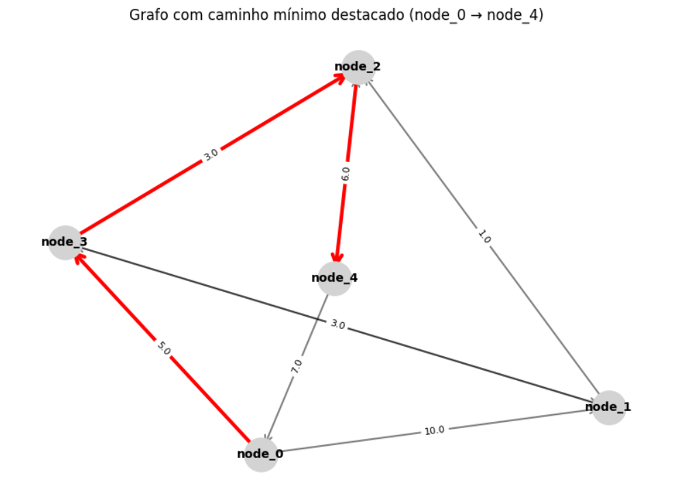
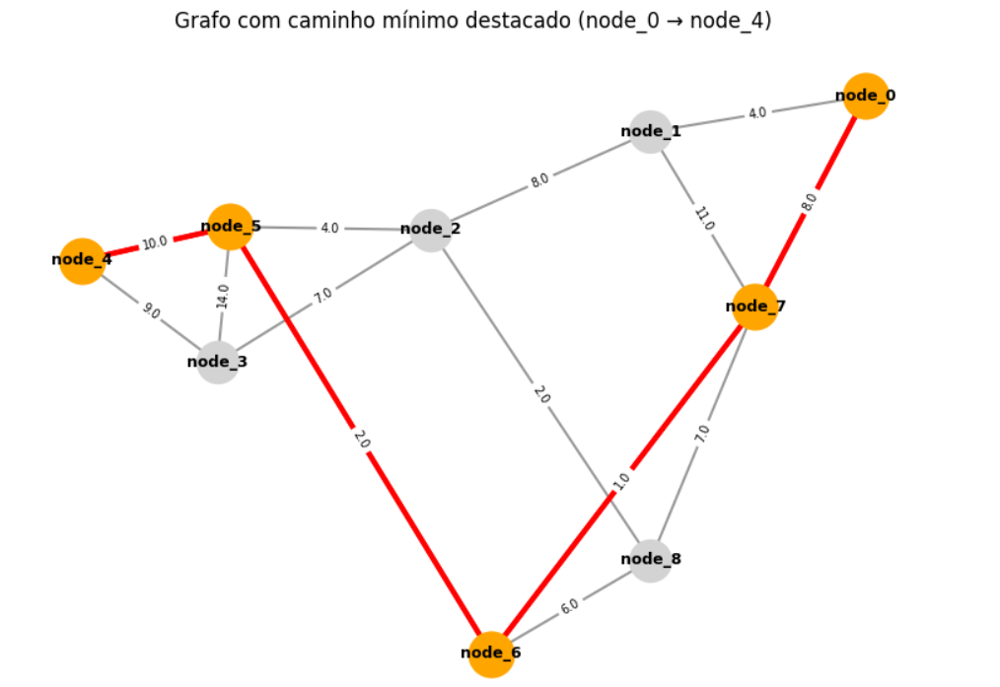

# RELATÓRIO
Trabalho Prático T1 \
EDPAA 2025/2 \
Leandro Furlam Turi \
Repositório: https://github.com/leandrofturi/EDPAA.git

## 1. Introdução

Este relatório descreve a implementação de uma solução para o problema de cálculo de caminhos mínimos em grafos direcionados e ponderados, conforme as especificações do Trabalho Prático T1 da disciplina Estruturas de Dados e Introdução a Projeto e Análise de Algoritmos.

O objetivo principal é, dado um grafo que representa uma rede de postos de transporte, determinar os caminhos de menor custo entre um vértice de origem e todos os demais vértices da rede, utilizando o algoritmo de Dijkstra.

Além da implementação correta do algoritmo, o trabalho exige modularização por meio de TADs opacos, organização do código, análise de desempenho e a proposição de pelo menos uma melhoria prática.

## 2. Estruturas Desenvolvidas

### 2.1. TAD Graph

Arquivo: **graph.py**

O TAD Graph representa o grafo direcionado utilizando listas de adjacência. Cada vértice possui uma lista contendo as arestas de saída, armazenadas como pares (destino, peso).

A escolha dessa estrutura ocorre porque:
* listas de adjacência consomem $O(V + E)$ memória, ao contrário de matrizes, que consomem $O(V^2)$,
* apenas arestas existentes são armazenadas, evitando gasto desnecessário em grafos esparsos,
* percorrer vizinhos é rápido e eficiente, beneficiando diretamente o algoritmo de Dijkstra.

### 2.2. TAD PriorityHeap

Arquivo: **heap.py**

Implementa uma fila de prioridades mínima com suporte à operação decrease key.
A heap é útil para Dijkstra porque permite:
* extrair o vértice com menor distância conhecida em $O(log V)$;
* atualizar prioridades quando uma distância menor é encontrada.

Sem heap, a busca pelo menor vértice custaria $O(V)$, levando Dijkstra a $O(V \times V)$, inadequado para grafos grandes.

### 2.3. TAD Dijkstra

Arquivo: **Dijkstra.py**

Implementa o algoritmo de Dijkstra para determinar os menores caminhos a partir de um vértice de origem.

## 3. Leitura, Construção e Execução

### 3.1. Entrada

A leitura da entrada é realizada no arquivo **trab1.py**, que interpreta o vértice de origem, os nomes dos nós e a lista de adjacências de pesos.

A rotina de leitura do grafo processa um arquivo em que, para cada vértice, são fornecidas as distâncias para todos os demais vértices da rede. Isso implica que o número total de pesos na entrada seja proporcional a $O(V \times (V-1))$, onde $V$ é o número de vértices.

Caso a distância entre nós não seja numérica (por exemplo, `'bomba'`) esta aresta não é adicionada ao grafo. Arestas com distâncias negativas ou nulas também são ignoradas. De acordo com a execução do algoritmo via linha de comando, pode-se obter o log de erros de todas as entradas inválidas.

### 3.2. Execução do Algoritmo

Após a leitura, o programa instancia a classe Dijkstra, que inicializa distâncias, heap e executa até encontrar os caminhos mínimos.

### 3.3. Saída

A saída segue o padrão:\
`SHORTEST PATH TO node_x: node_x <- ... <- node_src (Distance: XX.XX)`

## 4. Análise da Implementação

### 4.1. Correção

A implementação segue o [algoritmo clássico de Dijkstra](https://en.wikipedia.org/wiki/Dijkstra%27s_algorithm):
* distâncias inicializadas com infinito,
* uso de heap mínima para coordenar extrações,
* processo de relaxação de arestas,
* caminhos reconstruídos por antecessores.

Testes com grafos pequenos confirmaram a solução.

#### 4.1.1. Teste 1
 ```
$ python trab1.py input/caso_teste_muito_pequeno_1.txt 

=== GRAPH ===
node_0 -> node_1(10.0), node_3(5.0)
node_1 -> node_2(1.0), node_3(2.0)
node_2 -> node_4(4.0)
node_3 -> node_1(3.0), node_2(3.0)
node_4 -> node_0(7.0), node_2(6.0)
=============

SHORTEST PATH TO node_0: node_0 (Distance: 0.00)
SHORTEST PATH TO node_3: node_3 <- node_0 (Distance: 5.00)
SHORTEST PATH TO node_1: node_1 <- node_3 <- node_0 (Distance: 8.00)
SHORTEST PATH TO node_2: node_2 <- node_3 <- node_0 (Distance: 8.00)
SHORTEST PATH TO node_4: node_4 <- node_2 <- node_3 <- node_0 (Distance: 12.00)
```

[](output/grafo1.PNG)

#### 4.1.2. Teste 2
 ```
$ python trab1.py input/caso_teste_muito_pequeno_2.txt 

=== GRAPH ===
node_0 -> node_1(4.0), node_7(8.0)
node_1 -> node_0(4.0), node_2(8.0), node_7(11.0)
node_2 -> node_1(8.0), node_3(7.0), node_5(4.0), node_8(2.0)
node_3 -> node_2(7.0), node_4(9.0), node_5(14.0)
node_4 -> node_3(9.0), node_5(10.0)
node_5 -> node_2(4.0), node_3(14.0), node_4(10.0), node_6(2.0)
node_6 -> node_5(2.0), node_7(1.0), node_8(6.0)
node_7 -> node_0(8.0), node_1(11.0), node_6(1.0), node_8(7.0)
node_8 -> node_2(2.0), node_6(6.0), node_7(7.0)
=============

SHORTEST PATH TO node_0: node_0 (Distance: 0.00)
SHORTEST PATH TO node_1: node_1 <- node_0 (Distance: 4.00)
SHORTEST PATH TO node_7: node_7 <- node_0 (Distance: 8.00)
SHORTEST PATH TO node_6: node_6 <- node_7 <- node_0 (Distance: 9.00)
SHORTEST PATH TO node_5: node_5 <- node_6 <- node_7 <- node_0 (Distance: 11.00)
SHORTEST PATH TO node_2: node_2 <- node_1 <- node_0 (Distance: 12.00)
SHORTEST PATH TO node_8: node_8 <- node_2 <- node_1 <- node_0 (Distance: 14.00)
SHORTEST PATH TO node_3: node_3 <- node_2 <- node_1 <- node_0 (Distance: 19.00)
SHORTEST PATH TO node_4: node_4 <- node_5 <- node_6 <- node_7 <- node_0 (Distance: 21.00)
```

[](output/grafo2.PNG)


### 4.2. Desempenho

Considerando listas de adjacência e heap mínima:

A leitura da entrada realiza dois loops: primeiro para rearranjar as linhas, depois um duplo laço de arestas $u$ e $v$ (ignorando diagonal), lendo $O(V \times (V-1))$ valores e adicionando aresta quando peso positivo e não nulo. 

Na implementação de Dijkstra, ocorre: (1) inicialização de distâncias e nós raizes em $O(V)$; (2) push na heap para todos os vértices de $O(V \times log V)$; (3) a cada aresta relaxada, potencialmente um decrease key de $O(log V)$. 

* construção do grafo: $O(V \times (V-1) + E)$
* inicialização da heap: $O(V)$
* extrações da heap: $V \times O(log V)$
* relaxações: $E \times O(log V)$

Portanto, a complexidade total é:

$O((V + E) log V)$

### 4.3. Consumo de Memória

Para leitura dos nós e construção da lista de adjacência: $O(V + E)$. A heap de prioridade guarda a lista de pares (key, item) e o dicionário de posições, que no pior caso, possui um item por vértice: $O(V)$. Já em Dijkstra, há as distâncias e nós raízes de $O(V)$.

Portanto o consumo de memória é descrito por:
* lista de adjacência: $O(V + E)$
* heap: até $V$ elementos
* vetor de distâncias: $O(V)$
* vetor de antecessores: $O(V)$
* mapeamento nome -> índice é implícito, a partir do sufixo numérico de `node_i`: $O(V)$

Total aproximado:

$O(V + E)$

## 5. Melhoria Prática Implementada

### 5.1. Heap com decrease key

Durante o algoritmo, sempre que uma aresta é relaxada, pode surgir uma distância menor para um vértice. A heap precisa refletir essa atualização:
(1) Sem decrease key seria necessário reinserir o vértice, deixando entradas antigas e aumentando drasticamente o custo de operações. (2) Com decrease key atualiza-se a prioridade diretamente, com [custo $O(log V)$](https://en.wikipedia.org/wiki/Dijkstra%27s_algorithm).

Isso reduz o número de comparações, mantém a heap limpa e melhora o desempenho em grafos com muitas relaxações.

## 6. Resultados

Foram realizadas três execuções (com resultados verificados) e calculada a média dos tempos de execução, com o script `analysis.py`.

### 6.1. Casos de Teste Muito Pequenos

Com decrease key, os tempos são praticamente instantâneos.
Sem decrease key, um dos casos teve tempo de leitura ridiculamente alto (provavelmente interferência de SO / cache / qualquer coisa).

| Arquivo         | Vértices | Arestas | T_Dijkstra c/ decrease_key (s) | T_Dijkstra s/ decrease_key (s) | T_total c/ decrease_key (s) | T_total s/ decrease_key (s) |
| --------------- | -------- | ------- | ------------------------------ | ------------------------------ | --------------------------- | --------------------------- |
| muito_pequeno_1 | 5        | 9       | 0.000028                       | 0.000261                       | 0.000198                    | 0.001406                    |
| muito_pequeno_2 | 9        | 28      | 0.000077                       | 0.212195                       | 0.000288                    | 2.156409                    |

### 6.2. Casos de Teste Pequenos

Para 100 vértices, decrease key é consistentemente mais rápido tanto no Dijkstra quanto no tempo total.
Para 1000 vértices, o algoritmo em si é mais rápido com decrease key, mas o tempo total às vezes fica menor sem decrease key por conta da leitura mais lenta nas execuções com decrease key.

| Arquivo   | Vértices | Arestas | T_Dijkstra c/ decrease_key (s) | T_Dijkstra s/ decrease_key (s) | T_total c/ decrease_key (s) | T_total s/ decrease_key (s) |
| --------- | -------- | ------- | ------------------------------ | ------------------------------ | --------------------------- | --------------------------- |
| pequeno_1 | 100      | 9396    | 0.002430                       | 0.003723                       | 0.013694                    | 0.024049                    |
| pequeno_2 | 100      | 9464    | 0.003073                       | 0.003818                       | 0.018118                    | 0.013249                    |
| pequeno_3 | 1000     | 950594  | 0.229626                       | 0.222407                       | 1.534337                    | 1.100057                    |
| pequeno_4 | 1000     | 950992  | 0.229726                       | 0.229818                       | 1.502466                    | 1.189221                    |


### 6.3. Casos de Teste Médios

Em todos os casos médios, o tempo de Dijkstra com decrease key é menor. No tempo total, a versão com decrease key também é melhor em 3 casos e levemente pior em 1.

| Arquivo | Vértices | Arestas  | T_Dijkstra c/ decrease_key (s) | T_Dijkstra s/ decrease_key (s) | T_total c/ decrease_key (s) | T_total s/ decrease_key (s) |
| ------- | -------- | -------- | ------------------------------ | ------------------------------ | --------------------------- | --------------------------- |
| medio_1 | 5000     | 23795458 | 4.963747                       | 5.675444                       | 32.612704                   | 32.762997                   |
| medio_2 | 5000     | 23796772 | 5.205457                       | 5.780633                       | 32.778974                   | 32.747763                   |
| medio_3 | 5000     | 23796502 | 5.312102                       | 5.954480                       | 33.086889                   | 33.535645                   |
| medio_4 | 6000     | 34273941 | 7.308799                       | 8.153548                       | 46.664619                   | 50.010618                   |

### 6.4. Impacto da Melhoria Prática (decrease key)

Com as médias das três execuções para todos os arquivos, a vantagem do decrease key no tempo do algoritmo é consistente.

| Implementação    | Tempo médio Dijkstra (s) | Tempo médio total (s) | Diferença no tempo de Dijkstra |
| ---------------- | ------------------------ | --------------------- | ------------------------------ |
| Com decrease_key | 2.43                     | 14.76                 | ~ 12% mais rápido              |
| Sem decrease_key | 2.76                     | 15.28                 | –                              |


## 7. Conclusão

O trabalho implementa de forma completa e modular o grafo dirigido com lista de adjacência, heap mínima com decrease key, algoritmo de Dijkstra, bem como a análise detalhada de desempenho e memória. Os testes confirmam que a implementação é eficiente, correta e escalável. A melhoria prática reduz significativamente o tempo de execução sem aumentar o consumo de memória.
